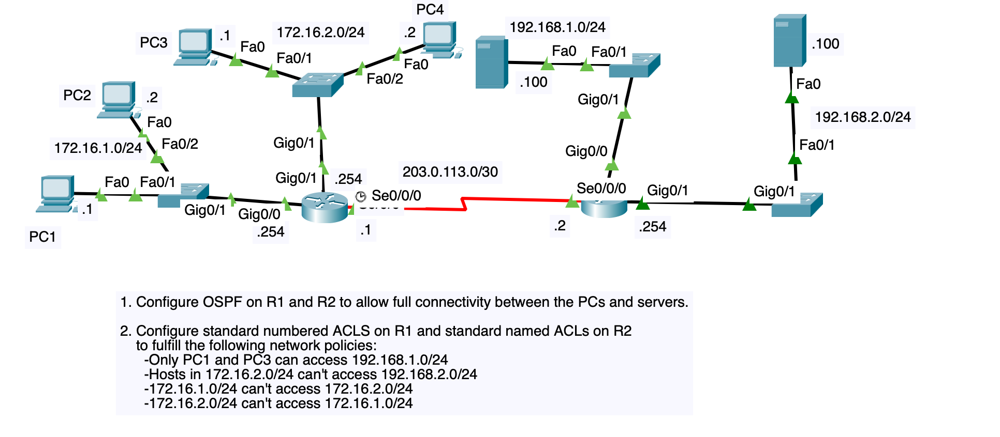

# OSPF + Standard ACL Lab (Cisco Packet Tracer)

A two-router topology used to practice **single-area OSPF** routing together
with **standard IP access control lists** — numbered ACLs on R1, named ACLs
on R2 — enforcing four traffic policies between two internal sites and two
server LANs.



## Contents

```
.
├── README.md
├── LICENSE
├── configs/
│   ├── R1.cfg          # R1 running-config (OSPF + ACL 10 / ACL 11)
│   ├── R2.cfg          # R2 running-config (OSPF + named ACLs)
│   ├── SW1.cfg          # Switch for PC3 / PC4  (172.16.2.0/24)
│   ├── SW2.cfg          # Switch for PC1 / PC2  (172.16.1.0/24)
│   ├── SW3.cfg          # Switch for Server1    (192.168.1.0/24)
│   └── SW4-SW5.cfg      # Cascaded switches for Server2 (192.168.2.0/24)
└── docs/
    ├── topology.png
    └── addressing-table.md
```

> A ready-made Packet Tracer / GNS3 topology can be rebuilt directly from
> `docs/topology.png` and the addressing table below; the `configs/` files
> are the exact CLI you'd paste into each device (or feed into `startup-config`).

## Topology Summary

| Segment              | Network            | Devices               | Gateway (Router)      |
|-----------------------|--------------------|-------------------------|-------------------------|
| Site A - LAN 1         | 172.16.1.0/24      | PC1, PC2               | R1 Gi0/0 (.254)         |
| Site A - LAN 2         | 172.16.2.0/24      | PC3, PC4               | R1 Gi0/1 (.254)         |
| WAN link               | 203.0.113.0/30     | R1 <-> R2               | R1 .1 (DCE) / R2 .2 (DTE) |
| Site B - LAN 1         | 192.168.1.0/24     | Server1                | R2 Gi0/0 (.254)         |
| Site B - LAN 2         | 192.168.2.0/24     | Server2                | R2 Gi0/1 (.254)         |

Full IP plan: [docs/addressing-table.md](docs/addressing-table.md)

## 1. Routing - OSPF

Single-area OSPF (area 0), process ID 1, runs between R1 and R2 across the
203.0.113.0/30 WAN link so every PC and server has full IP reachability.
LAN-facing interfaces are set `passive-interface` since no OSPF neighbors
live on those segments.

```
router ospf 1
 router-id 1.1.1.1                      ! 2.2.2.2 on R2
 network 172.16.1.0   0.0.0.255 area 0
 network 172.16.2.0   0.0.0.255 area 0
 network 203.0.113.0  0.0.0.3   area 0
 passive-interface GigabitEthernet0/0
 passive-interface GigabitEthernet0/1
```

## 2. Access Control - Network Policies

Standard ACLs only match **source address**, so each one is applied as
close to the **destination** network as possible, in the **outbound**
direction on that router's LAN interface — this is what lets a single
standard ACL enforce a destination-specific rule without accidentally
blocking unrelated traffic elsewhere in the network.

| # | Policy                                                        | Enforced on | Interface (out) | ACL              |
|---|----------------------------------------------------------------|-------------|-------------------|--------------------|
| 1 | Only PC1 and PC3 can reach 192.168.1.0/24                     | R2          | Gi0/0             | `ALLOW_SERVER1` (named) |
| 2 | 172.16.2.0/24 cannot reach 192.168.2.0/24                     | R2          | Gi0/1             | `BLOCK_16_2_TO_SVR2` (named) |
| 3 | 172.16.1.0/24 cannot reach 172.16.2.0/24                      | R1          | Gi0/1             | `10` (numbered)     |
| 4 | 172.16.2.0/24 cannot reach 172.16.1.0/24                      | R1          | Gi0/0             | `11` (numbered)     |

### R1 - numbered ACLs

```
access-list 10 deny   172.16.1.0 0.0.0.255
access-list 10 permit any
interface GigabitEthernet0/1
 ip access-group 10 out

access-list 11 deny   172.16.2.0 0.0.0.255
access-list 11 permit any
interface GigabitEthernet0/0
 ip access-group 11 out
```

### R2 - named ACLs

```
ip access-list standard ALLOW_SERVER1
 permit host 172.16.1.1
 permit host 172.16.2.1
 deny any
interface GigabitEthernet0/0
 ip access-group ALLOW_SERVER1 out

ip access-list standard BLOCK_16_2_TO_SVR2
 deny   172.16.2.0 0.0.0.255
 permit any
interface GigabitEthernet0/1
 ip access-group BLOCK_16_2_TO_SVR2 out
```

**Note:** the WAN interfaces (`Se0/0/0`) intentionally carry **no** ACL so
OSPF adjacency and inter-router traffic are never affected by the LAN
access policies above.

## How to deploy

1. Build the topology (2 routers, 5 switches, 6 end devices) matching
   `docs/topology.png` and `docs/addressing-table.md`.
2. Paste each file in `configs/` into the matching device's terminal in
   global configuration mode (`enable` → `configure terminal`), or load it
   as the device's `startup-config`.
3. Save configs: `copy running-config startup-config` on every device.

## Verification checklist

```
! OSPF
show ip ospf neighbor          ! FULL adjacency between R1 <-> R2
show ip route ospf             ! remote LANs learned via OSPF

! ACL policy 1 - only PC1/PC3 reach Server1
ping 192.168.1.100   (from PC1)   -> success
ping 192.168.1.100   (from PC3)   -> success
ping 192.168.1.100   (from PC2)   -> fails
ping 192.168.1.100   (from PC4)   -> fails

! ACL policy 2
ping 192.168.2.100   (from PC3 or PC4) -> fails
ping 192.168.2.100   (from PC1 or PC2) -> succeeds

! ACL policy 3 / 4 - 172.16.1.0/24 <-x-> 172.16.2.0/24
ping 172.16.2.1      (from PC1)   -> fails
ping 172.16.1.1      (from PC3)   -> fails

! Inspect hit counters
show access-lists
```

## License

MIT - see [LICENSE](LICENSE).
